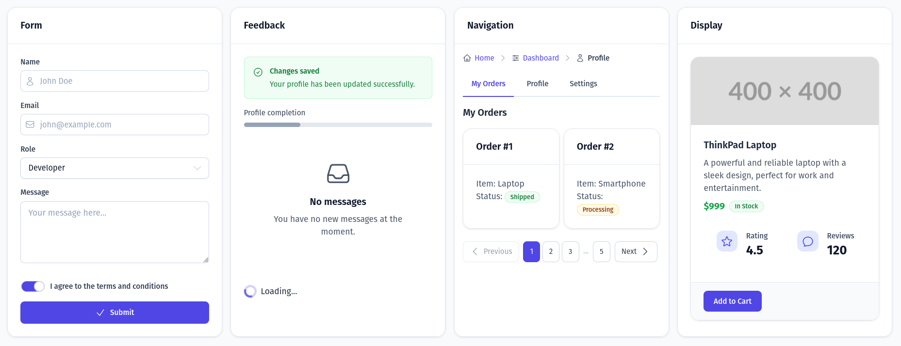

<p align="center">
    
</p>

# Basekit Laravel UI

A modular Laravel UI component library built with **Blade components**, **Tailwind 4 CSS**, and **Alpine.js** for rich, interactive interfaces.  
Create rich, production‑ready UIs faster with 33 pre‑built components, configurable theming, and a built‑in style guide.

Explore all components in the [style guide](https://basekit-laravel.github.io/basekit-laravel-ui/styleguide.html) and read the full docs at [basekit‑laravel.github.io/basekit‑laravel‑ui](https://basekit-laravel.github.io/basekit-laravel-ui).

---

## 🌟 Features

- 🎨 **Tailwind 4 CSS‑based theming** – Runtime customization via CSS variables.
- ✨ **Heroicons integration** – Beautiful icons out of the box.
- 🔧 **Component toggle & defaults** – Enable/disable components and set default variants and sizes.
- 🌲 **Component‑aware CSS build** – Include CSS only for enabled components.
- 🎯 **Type‑safe components** – PHP classes with IDE autocomplete.
- 📦 **Publishable views** – Customize component templates directly.

---

## 📦 Installation

### Basic Setup

Install via Composer:

```bash
composer require basekit-laravel/basekit-laravel-ui
```

Include the CSS in your main CSS file:

```css
@import "./vendor/basekit-laravel/v1/basekit-ui.css";
```

### Include Alpine.js

Several Basekit components (Accordion, Dropdown Menu, Input password toggle, Modal, Multi-Select, Tabs, Toast, Tooltip, and Table) require Alpine.js. Add it to your layout:

```blade
<script defer src="https://cdn.jsdelivr.net/npm/alpinejs@3.x.x/dist/cdn.min.js"></script>
```

Or with Livewire, use `@livewireScripts` which includes Alpine.js automatically:

```blade
@livewireScripts
```

See the [installation guide](https://basekit-laravel.github.io/basekit-laravel-ui/guide/installation.html) for more details.

### Advanced Setup

Publish the configuration file:

```bash
php artisan vendor:publish --tag=basekit-laravel-ui-config
```

Publish the CSS theme:

```bash
php artisan vendor:publish --tag=basekit-laravel-ui-css-v1
```

Build optimized CSS based on your configuration:

```bash
php artisan basekit:ui:build
```

For development, use watch mode:

```bash
php artisan basekit:ui:build --watch
```

---

## 🧩 Available Components

The package includes **33 components** organized into 6 categories.

### Form Components (8)

- [Button](https://basekit-laravel.github.io/basekit-laravel-ui/components/button.html)
- [Input](https://basekit-laravel.github.io/basekit-laravel-ui/components/input.html)
- [Textarea](https://basekit-laravel.github.io/basekit-laravel-ui/components/textarea.html)
- [Checkbox](https://basekit-laravel.github.io/basekit-laravel-ui/components/checkbox.html)
- [Radio](https://basekit-laravel.github.io/basekit-laravel-ui/components/radio.html)
- [Select](https://basekit-laravel.github.io/basekit-laravel-ui/components/select.html)
- [Multi‑Select](https://basekit-laravel.github.io/basekit-laravel-ui/components/multi-select.html)
- [Toggle](https://basekit-laravel.github.io/basekit-laravel-ui/components/toggle.html)

### Feedback Components (7)

- [Alert](https://basekit-laravel.github.io/basekit-laravel-ui/components/alert.html)
- [Toast](https://basekit-laravel.github.io/basekit-laravel-ui/components/toast.html)
- [Tooltip](https://basekit-laravel.github.io/basekit-laravel-ui/components/tooltip.html)
- [Progress](https://basekit-laravel.github.io/basekit-laravel-ui/components/progress.html)
- [Spinner](https://basekit-laravel.github.io/basekit-laravel-ui/components/spinner.html)
- [Skeleton](https://basekit-laravel.github.io/basekit-laravel-ui/components/skeleton.html)
- [Empty State](https://basekit-laravel.github.io/basekit-laravel-ui/components/empty-state.html)

### Navigation Components (5)

- [Breadcrumb](https://basekit-laravel.github.io/basekit-laravel-ui/components/breadcrumb.html)
- [Pagination](https://basekit-laravel.github.io/basekit-laravel-ui/components/pagination.html)
- [Tabs](https://basekit-laravel.github.io/basekit-laravel-ui/components/tabs.html)
- [Dropdown Menu](https://basekit-laravel.github.io/basekit-laravel-ui/components/dropdown-menu.html)
- [Link](https://basekit-laravel.github.io/basekit-laravel-ui/components/link.html)

### Layout Components (4)

- [Stack](https://basekit-laravel.github.io/basekit-laravel-ui/components/stack.html)
- [Grid](https://basekit-laravel.github.io/basekit-laravel-ui/components/grid.html)
- [Container](https://basekit-laravel.github.io/basekit-laravel-ui/components/container.html)
- [Divider](https://basekit-laravel.github.io/basekit-laravel-ui/components/divider.html)

### Display Components (7)

- [Table](https://basekit-laravel.github.io/basekit-laravel-ui/components/table.html)
- [List](https://basekit-laravel.github.io/basekit-laravel-ui/components/list.html)
- [Description List](https://basekit-laravel.github.io/basekit-laravel-ui/components/description-list.html)
- [Stat](https://basekit-laravel.github.io/basekit-laravel-ui/components/stat.html)
- [Card](https://basekit-laravel.github.io/basekit-laravel-ui/components/card.html)
- [Badge](https://basekit-laravel.github.io/basekit-laravel-ui/components/badge.html)
- [Avatar](https://basekit-laravel.github.io/basekit-laravel-ui/components/avatar.html)

### Dialog & Overlay (2)

- [Modal](https://basekit-laravel.github.io/basekit-laravel-ui/components/modal.html)
- [Accordion](https://basekit-laravel.github.io/basekit-laravel-ui/components/accordion.html)

---

## 🧾 Example Form

```blade
<x-basekit-ui::container>
    <x-basekit-ui::card>
        <x-slot:header>
            <h2 class="text-xl font-bold">Create Account</h2>
        </x-slot>

        <form method="POST" action="/register">
            @csrf

            <x-basekit-ui::stack spacing="lg">
                <x-basekit-ui::input
                    name="name"
                    label="Name"
                    icon="user"
                    :error="$errors->first('name')"
                />

                <x-basekit-ui::input
                    name="email"
                    type="email"
                    label="Email"
                    icon="envelope"
                    :error="$errors->first('email')"
                />

                <x-basekit-ui::input
                    name="password"
                    type="password"
                    label="Password"
                    hint="Must be at least 8 characters"
                    icon="lock-closed"
                    :error="$errors->first('password')"
                />

                <x-basekit-ui::checkbox
                    name="terms"
                    label="I agree to the terms and conditions"
                />
            </x-basekit-ui::stack>

            <x-slot:footer>
                <div class="flex justify-between items-center">
                    <x-basekit-ui::link href="/login">
                        Already have an account?
                    </x-basekit-ui::link>

                    <x-basekit-ui::button
                        type="submit"
                        variant="primary"
                        icon="arrow-right"
                    >
                        Create Account
                    </x-basekit-ui::button>
                </div>
            </x-slot>
        </form>
    </x-basekit-ui::card>
</x-basekit-ui::container>
```

Browse all available components in the [style guide](https://basekit-laravel.github.io/basekit-laravel-ui/styleguide.html) and read the full docs at [basekit-laravel.github.io/basekit-laravel-ui](https://basekit-laravel.github.io/basekit-laravel-ui).

---

## ⚙️ Configuration

Edit `config/basekit-laravel-ui.php` to customize components:

```php
return [
    'components' => [
        'button' => [
            'enabled' => true,
            'variants' => ['primary', 'secondary', 'danger'],
            'sizes' => ['sm', 'md', 'lg'],
            'default_variant' => 'primary',
            'default_size' => 'md',
        ],
        // ... more components
    ],

    'icons' => [
        'style' => 'outline', // outline, solid, mini
    ],

    'build' => [
        'debounce_ms' => 500,
    ],
];
```

After changing configuration, rebuild CSS:

```bash
php artisan basekit:ui:build
```

For development, use watch mode:

```bash
php artisan basekit:ui:build --watch
```

---

## 🎨 Customization

### CSS Variables

Override theme variables in your CSS:

```css
:root {
  --color-primary-600: #your-brand-color;
  --button-radius: 0.5rem;
  --card-padding: 2rem;
}
```

See the full list of available variables in the [Complete CSS variable reference](https://basekit-laravel.github.io/basekit-laravel-ui/guide/theming.html#complete-css-variable-reference) in the documentation.

### Publishing Views

Publish component views for full customization:

```bash
php artisan vendor:publish --tag=basekit-views
```

Published views are copied to `resources/views/vendor/basekit/` and automatically override package components.

---

## 📐 Styling Conventions

- Component CSS uses **BEM** with the `bk-` prefix (blocks, elements, and modifiers).
- Tailwind utilities are for **component usage** in Blade markup (layout, spacing, overrides).
- When combining classes, **Tailwind Merge** handles conflicts for the `class` attribute.

---

## 🧪 CI Quality Checks

The CI workflow validates production readiness on pushes and pull requests by running:

- Feature tests: `php vendor/bin/pest --no-coverage`
- CSS build: `./vendor/bin/testbench basekit:ui:build`
- Styleguide generation: `./vendor/bin/testbench basekit:ui:styleguide`
- CSS/docs token sync guard: `bash tools/verify-doc-token-sync.sh`

You can run these locally before opening a pull request.

---

## ⚡ Performance

Component‑based builds can significantly reduce bundle size:

- Full bundle (all components): ~200KB
- Minimal config (3 components): ~55KB
- **Reduction: 73%**

---

## 🔄 Migration

See [CHANGELOG.md](CHANGELOG.md) for version changes and migration guides.

---

## 📚 Documentation

Full documentation available at:  
[https://basekit-laravel.github.io/basekit-laravel-ui](https://basekit-laravel.github.io/basekit-laravel-ui)

See also:

- [IMPLEMENTATION.md](IMPLEMENTATION.md) — Architecture and development guide
- [STRUCTURE.md](STRUCTURE.md) — Component organization and relationships

---

## 📄 License

The MIT License (MIT). Please see the [LICENSE](LICENSE) file for more information.
