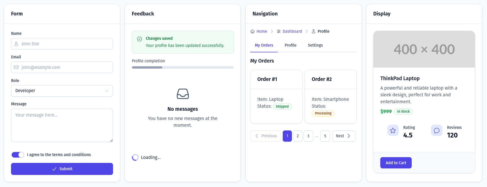

<p align="center">
    
</p>

# Basekit Laravel UI

[](https://packagist.org/packages/basekit-laravel/basekit-laravel-ui)

**Build polished Laravel interfaces without rebuilding the same UI components every time.**
Basekit Laravel UI is a collection of **35 production-ready Blade components** for Laravel, powered by **Tailwind CSS** and **Alpine.js**.
Buttons, inputs, modals, tables, dropdowns, tabs, toasts, pagination and more — ready to drop into your Laravel application and customize to match your brand.

Explore all components in the [style guide](https://basekit-laravel.github.io/basekit-laravel-ui/styleguide.html) and read the full docs at [basekit‑laravel.github.io/basekit‑laravel‑ui](https://basekit-laravel.github.io/basekit-laravel-ui).

---

## ✨ Why Basekit?

Laravel makes building applications enjoyable. Building and maintaining the same buttons, inputs, modals, dropdowns and other UI primitives for every application doesn't.

Basekit gives you a reusable UI foundation while keeping you in the Laravel ecosystem:

- 🧩 **35 ready-to-use components** — from form controls to modals, tables, navigation and feedback.
- 🧱 **Blade first** — use familiar Laravel Blade components instead of adopting another frontend framework.
- 🎨 **Tailwind CSS** — works naturally alongside your existing Tailwind application.
- 🖌️ **Easy theming** — customize colors, spacing and other design tokens with CSS variables.
- ⚡ **Alpine-powered interactions** — interactive components without building a JavaScript application.
- 🎯 **IDE friendly** — PHP component classes provide autocomplete and discoverable APIs.
- 🔧 **Own the markup when you need to** — publish component views and customize them directly.
- 📦 **Ship less CSS** — enable only the components you use and build an optimized stylesheet.

---

## 🚀 Quick Start

Install the package:

```bash id="v5gnyd"
composer require basekit-laravel/basekit-laravel-ui
```

Import Basekit's CSS into your application's stylesheet:

```css
@import "./vendor/basekit-laravel/v1/basekit-ui.css";
```

If you're already using Livewire, Alpine.js is available through `@livewireScripts`.

Otherwise, include Alpine.js in your layout:

```blade
<script defer src="https://cdn.jsdelivr.net/npm/alpinejs@3.x.x/dist/cdn.min.js"></script>
```

Now use Basekit components directly from Blade:

```blade
<x-basekit-ui::card>
    <x-slot:header>
        <h2 class="text-xl font-semibold">Welcome back</h2>
    </x-slot>

    <x-basekit-ui::stack spacing="lg">
        <x-basekit-ui::input
            name="email"
            type="email"
            label="Email"
            icon="envelope"
        />

        <x-basekit-ui::input
            name="password"
            type="password"
            label="Password"
        />

        <x-basekit-ui::button type="submit" variant="primary">
            Sign in
        </x-basekit-ui::button>
    </x-basekit-ui::stack>
</x-basekit-ui::card>
```

That's it. No component scaffolding required.

See the [installation guide](https://basekit-laravel.github.io/basekit-laravel-ui/guide/installation.html) for more details.

---

## 🎨 Built for Customization

Basekit comes with sensible defaults, but gives you full control when you need it.

### CSS Variables

For quick customization, override Basekit's CSS variables in your application:

```css
:root {
  --color-primary-600: #your-brand-color;
  --button-radius: 0.5rem;
  --card-padding: 2rem;
}
```

### Publishing Views

Publish component views for full customization:

```bash
php artisan vendor:publish --tag=basekit-views
```

Published views are copied to `resources/views/vendor/basekit/` and automatically override package components.

### Publish the Configuration

Need more control over components, variants, sizes, and defaults? Publish the configuration file:

```bash
php artisan vendor:publish --tag=basekit-laravel-ui-config
```

### Customize the Theme

Publish the Basekit CSS theme to customize the source styles directly:

```bash
php artisan vendor:publish --tag=basekit-laravel-ui-css-v1
```

### Build Your CSS

Build an optimized stylesheet based on your configuration:

```bash
php artisan basekit:ui:build
```

While developing, use watch mode to automatically rebuild when your configuration or styles change:

```bash
php artisan basekit:ui:build --watch
```

Need complete control over the markup? You can also publish the component views and customize them directly:

```bash
php artisan vendor:publish --tag=basekit-views
```

Learn more about [theming and customization](https://basekit-laravel.github.io/basekit-laravel-ui/guide/theming.html).

## 🧩 Available Components

The package includes **35 components** organized into 8 categories.

### 📝 Form Components (10)

- [Button](https://basekit-laravel.github.io/basekit-laravel-ui/components/button.html)
- [Input](https://basekit-laravel.github.io/basekit-laravel-ui/components/input.html)
- [Textarea](https://basekit-laravel.github.io/basekit-laravel-ui/components/textarea.html)
- [Checkbox](https://basekit-laravel.github.io/basekit-laravel-ui/components/checkbox.html)
- [Radio](https://basekit-laravel.github.io/basekit-laravel-ui/components/radio.html)
- [Select](https://basekit-laravel.github.io/basekit-laravel-ui/components/select.html)
- [Multi‑Select](https://basekit-laravel.github.io/basekit-laravel-ui/components/multi-select.html)
- [Toggle](https://basekit-laravel.github.io/basekit-laravel-ui/components/toggle.html)
- [Fieldset](https://basekit-laravel.github.io/basekit-laravel-ui/components/fieldset.html)
- [Copy Button](https://basekit-laravel.github.io/basekit-laravel-ui/components/copy-button.html)

### 💬 Feedback Components (7)

- [Alert](https://basekit-laravel.github.io/basekit-laravel-ui/components/alert.html)
- [Toast](https://basekit-laravel.github.io/basekit-laravel-ui/components/toast.html)
- [Tooltip](https://basekit-laravel.github.io/basekit-laravel-ui/components/tooltip.html)
- [Progress](https://basekit-laravel.github.io/basekit-laravel-ui/components/progress.html)
- [Spinner](https://basekit-laravel.github.io/basekit-laravel-ui/components/spinner.html)
- [Skeleton](https://basekit-laravel.github.io/basekit-laravel-ui/components/skeleton.html)
- [Empty State](https://basekit-laravel.github.io/basekit-laravel-ui/components/empty-state.html)

### 🧭 Navigation Components (5)

- [Breadcrumb](https://basekit-laravel.github.io/basekit-laravel-ui/components/breadcrumb.html)
- [Pagination](https://basekit-laravel.github.io/basekit-laravel-ui/components/pagination.html)
- [Tabs](https://basekit-laravel.github.io/basekit-laravel-ui/components/tabs.html)
- [Dropdown Menu](https://basekit-laravel.github.io/basekit-laravel-ui/components/dropdown-menu.html)
- [Link](https://basekit-laravel.github.io/basekit-laravel-ui/components/link.html)

### 📐 Layout Components (4)

- [Stack](https://basekit-laravel.github.io/basekit-laravel-ui/components/stack.html)
- [Grid](https://basekit-laravel.github.io/basekit-laravel-ui/components/grid.html)
- [Container](https://basekit-laravel.github.io/basekit-laravel-ui/components/container.html)
- [Divider](https://basekit-laravel.github.io/basekit-laravel-ui/components/divider.html)

### 📊 Display Components (7)

- [Table](https://basekit-laravel.github.io/basekit-laravel-ui/components/table.html)
- [List](https://basekit-laravel.github.io/basekit-laravel-ui/components/list.html)
- [Description List](https://basekit-laravel.github.io/basekit-laravel-ui/components/description-list.html)
- [Stat](https://basekit-laravel.github.io/basekit-laravel-ui/components/stat.html)
- [Card](https://basekit-laravel.github.io/basekit-laravel-ui/components/card.html)
- [Badge](https://basekit-laravel.github.io/basekit-laravel-ui/components/badge.html)
- [Avatar](https://basekit-laravel.github.io/basekit-laravel-ui/components/avatar.html)

### 🪟 Overlay Components (2)

- [Modal](https://basekit-laravel.github.io/basekit-laravel-ui/components/modal.html)
- [Accordion](https://basekit-laravel.github.io/basekit-laravel-ui/components/accordion.html)

### 🛠️ Utilities (2)

- [SEO](https://basekit-laravel.github.io/basekit-laravel-ui/components/seo.html)
- [Theme Variables](https://basekit-laravel.github.io/basekit-laravel-ui/components/theme-variables.html)

Browse all available components in the [style guide](https://basekit-laravel.github.io/basekit-laravel-ui/styleguide.html) and read the full docs at [basekit-laravel.github.io/basekit-laravel-ui](https://basekit-laravel.github.io/basekit-laravel-ui).

---

## ⚡ Ship Only What You Use

Basekit can build its stylesheet based on the components enabled in your configuration.

In the included bundle-size comparison:

- **All components:** ~200 KB
- **3 components:** ~55 KB
- **Reduction:** ~73%

Configure the components you need:

```php id="mte2em"
'components' => [
    'button' => [
        'enabled' => true,
    ],
    // ...
],
```

Then build your optimized stylesheet:

```bash
php artisan basekit:ui:build
```

Use watch mode while developing:

```bash
php artisan basekit:ui:build --watch
```

---

## 📚 Documentation

Explore the **[full documentation](https://basekit-laravel.github.io/basekit-laravel-ui)** for installation, configuration, theming and component APIs.

Want to see everything first?

**[Browse the interactive component style guide →](https://basekit-laravel.github.io/basekit-laravel-ui/styleguide.html)**

---

## 📄 License

Basekit Laravel UI is open-source software licensed under the [**MIT License**](LICENSE).
